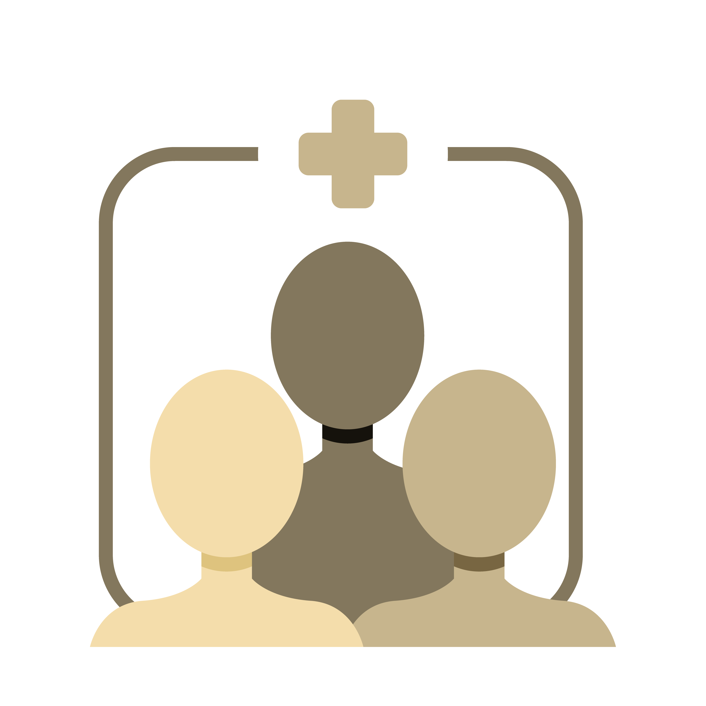

## Did you sleep well? 
Adults should sleep 7 or more hours per night on a regular basis to promote optimal health[1]. However, more than one-third of the US population gets less than the recommended amount of sleep (https://aasm.org/seven-or-more-hours-of-sleep-per-night-a-health-necessity-for-adults/). 
```{r,echo=FALSE,message=FALSE}
library(tidyverse)
library(ggplot2)
library(plyr)
library(plotly)
library(sf)
library(terra)
library(rgeos)
library(rgdal)
library(maptools)
library(dplyr)
library(leaflet)
library(scales)

df_500 <- read.csv("./500_Citie.csv") %>%
  as_tibble()
```

```{r, warning=FALSE, echo=FALSE}
df_500$GeoLocation <- gsub(pattern = '[()]', replacement = '', df_500$GeoLocation)
df_500 <- df_500 %>%
  mutate(sleep_duration = Data_Value * 24 / 100) %>%
  separate(GeoLocation, into = c("latitude", "longitude"), sep = ",") %>%
  na.omit()
```
  
  <div align=center>
```{r, echo=FALSE}
bins = c(3,5,7,9,11,13,15)
pal = colorBin("Reds", domain = df_500$sleep_duration, bins = bins)
leaflet(df_500) %>% 
  addProviderTiles("Esri.WorldStreetMap") %>%
  addCircleMarkers(~as.numeric(longitude),
                   ~as.numeric(latitude),
                  color = ~pal(sleep_duration),
                   stroke = FALSE,
                   fillOpacity = 1,
                   radius = 3,
                   popup = paste(df_500$StateDesc, '<br>', df_500$CityName,"<br>","Population:", df_500$PopulationCount,"Counts", "<br>","Sleep Duration:",df_500$sleep_duration,"hours")) %>%
  addLegend("topright", 
            pal = pal, 
            values = ~sleep_duration, 
            title = "Sleep duration/hour", 
            opacity = 0.8)
```
*Zoom the webpage to view more geographic details. Click on the circle markers to show the state name, city name, the number of people participating in the survey and the sleeping duration respectively.*

***

## Sleep & Individual Health

<div align=center>


>"Cappuccio FP, Miller MA. Sleep and Cardio-Metabolic Disease. Curr Cardiol Rep. 2017 Sep 19;19(11):110."

<div align=left>
Not getting enough sleep is linked with chronic diseases and adverse health conditions[1], threateniing the nation’s overall public health. Short sleep duration along with other dimensions of poor sleep has been associated with weight gain and obesity[2], type 2 diabetes[3],  increased risk of hypertension[4], cardiovascular disease[5] and depression[6, 7]. Sleep deprivation and disorders are also associated with impaired immune function[8], chronic pain[9], impaired performance, increased errors, and greater risk of accidents[10].
  
***

<div align=left>
## Sleep & Public Health
Intuitively, we tend to believe that sleep is only related to individual habits like caffeine intake or regular exercise. However, numerous studies have revealed that sleep is a central problem of public health, pointing out that differences in quantity or quality of sleep are related to a variety of biological, economic and social factors[11]. 

<div align=center>


>"Jackson CL, Redline S, Emmons KM. Sleep as a potential fundamental contributor to disparities in cardiovascular health. Annu Rev Public Health. 2015 Mar 18;36:417-40."

<div align=left>
It was reported in a CDC survey (https://www.cdc.gov/mmwr/preview/mmwrhtml/mm6412a10.htm) that 35.2% of people with incomes below the poverty line reported getting less than 6 hours of sleep per day, compared with the proportion of 27.7% among those with incomes more than four times the poverty line. The disparities between racial groups are even sharper. A rigorous 2015 study found that compared with whites matched for age and sex, Blacks were 5 times as likely to sleep for shorter periods. Hispanics and Chinese Americans were roughly 2 times as likely to get fewer hours of sleep than whites[12]. Furthermore, sleep deprivation and disorders could further lead to health problems[13, 14], poor academic and work performances[15, 16], which deepen inequalities among populations in the long run.  
  
***

<div align=left>
## Welcome to our project!
Sleep is a necessary physiological process for individuals, interacting with several economic, social, and physical factors, influencing risks of multiple health problems. Therefore, based on NHANES dataset, we focus on sleep-related public health issues to carry out our research, hoping to popularize the significance of adequate and healthy sleep, arousing the public's health awareness of improving sleep quality and obtaining adequate sleep duration. We also want to visualize and discuss the biological, economic, and social factors interacting with sleep, informing the public and healthcare providers on the importance of advocating public policy to promoting the nowadays sleep situation and overall public health.

***
<div align=left>
<a href ="References.html"></a>
**[Sleep & Diseases](Places_data.html)**  *Correlation analysis, modeling and prediction of sleep and disease.*

<a href ="References.html"></a>
**[Sleep & Social factors](Data.html)**  *Correlation analysis, modeling and prediction of sleep with major social factors.*

<a href ="References.html"></a>
**[Survey about sleep](https://rheaaa.shinyapps.io/myshiny/?_ga=2.230249179.631808033.1670647588-175632102.1670647588)**  *A questionnaire about sleep.*


<div align=center>
***
Welcome to watch the [Introduction](https://youtu.be/ud16xF0hgXA) video to learn more about our webpage! 
