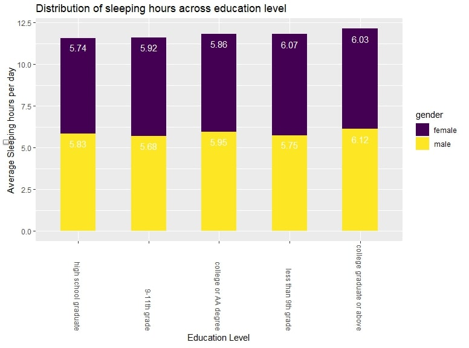
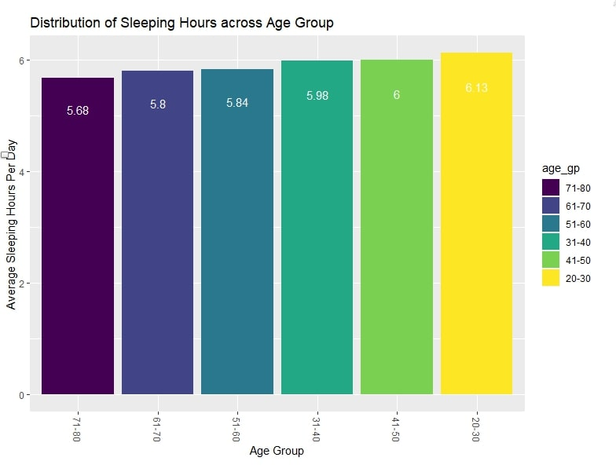

```{r setup, include=FALSE}
library(tidyverse)
library(patchwork)
library(knitr)
library(dplyr)
library(gganimate)
library(gifski)
library(png)
library(plotly)
library(ggridges)
library(xgboost)
library(readr)
library(stringr)
library(caret)
library(leaps)
library(modelr)
library(DiagrammeR)
library(glmnet)
library(corrplot)
knitr::opts_chunk$set(
  fig.height = 6,
  fig.width = 8,
  message = F,
  echo = T,
  warning = F
)
```

```{r}
options(
  ggplot2.continuous.colour = "viridis",
  ggplot2.continuous.fill = "viridis"
)

scale_colour_discrete = scale_colour_viridis_d
scale_fill_discrete = scale_fill_viridis_d

theme_set(theme_minimal() + theme(legend.position = "bottom"))

```
# Motivation

Adults should sleep 7 or more hours per night on a regular basis to promote optimal health.
However, more than one-third of the US population gets less than the recommended amount of sleep. Sleep is a necessary physiological process for individuals, interacting with several economic, social and physical factors, influencing risks of multiple health problems. Therefore, based on NHANES dataset, we focus on sleep-related public health issues to carry out our research, hoping to popularize the significance of adequate and healthy sleep, arousing the public's health awareness of improving sleep quality and obtaining adequate sleep duration. We also want to visualize and discuss the biological, economic and social factors interacting with sleep, informing the public and healthcare providers on the importance of advocating public policy to promoting the nowadays sleep situation and overall public health.

# Related Work
According to the website of American Academy of Sleep Medicine (https://aasm.org/seven-or-more-hours-of-sleep-per-night-a-health-necessity-for-adults/), seven or more hours of sleep per night is  a health necessity for adults. There are also thought-provoking articles in this website discussing the influences of social factors on the sleep of Americans, like how financial and political worries make people difficult to fall asleep(https://aasm.org/politics-are-keeping-americans-up-at-night-nearly-60-of-adults-struggle-to-fall-asleep-due-to-political-worries/).
Inspired by these works, we identified the main topics of our website to explore the biological, economic and social factors interacting with sleep, as well as collect and analyze more sleep data through the questionnaire page of our website. All the papers we referred to were concluded and linked to the references page.

# Initial Questions and Planned Analysis

 1. What is the correlation between insufficient sleep and physiological disease?
 2. Which age group has the shortest average sleeping time? Which education level has the shortest average sleeping time?
 3. Does short sleeping time indicates insufficient sleep? 

# Homepage
The homepage builds the main framework and content for the website, showing the research background and motivation of our project. Inspired by the the website of American Academy of Sleep Medicine (https://aasm.org/seven-or-more-hours-of-sleep-per-night-a-health-necessity-for-adults/) and the visualization in class of Airbnb in the New York area, We decided to visualize the sleep data of Americans intuitively, exploring the overall situation and the regional differences of the current Americans sleep as the our project background.

### Data preparation
The 'leaflet' pacakage was used to complete the interactivity and visualization of sleep data from 500 Cities dataset provided by the Centers for Disease Control and Prevention (CDC) (https://www.opendatanetwork.com/dataset/chronicdata.cdc.gov/eqbn-8mpz). 
To specify the coordinate values required to draw this map, I separated and read the latitude and longitude of each data point. 

### Visualization
Firstly, I got the basic layer from Esri.WorldStreetMap to add geographical boundaries to the map. Then, I mapped the data points from 500 Cities dataset on the basic layer. I added markers to indicate the sleep value, which was positioned by the latitude and longitude values of the corresponding city and the color was determined by the city's average sleep duration. The sleep duration of the current city can be obtained by comparing the color of a city with the legend on the upper right.

### Interactivity
The current map can be zoomed with the zoom button in the upper left corner or with mouse scrolling. To show more specific information, I added interactive popups and defined them. Click any previously added marker to get the name of the state to which the current city belongs, the city name, the number of people participating in the survey, and the average sleep duration of this city. 

# Sleep and Diseases
## Data Sources
* This data set is retrieved from Centers for Disease Control and Prevention, National Center for Chronic Disease Prevention and Health Promotion, Division of Population Health updated December 6, 2022, named [PLACES](https://chronicdata.cdc.gov/500-Cities-Places/PLACES-County-Data-GIS-Friendly-Format-2022-releas/i46a-9kgh).

## Data Cleaning
* We have extracted 11 physiological dieases to estimate the prevalence of insufficient sleep along with the identification variables including country name, population, and states. While all of the suffix of the raw varieties are changed, we finally keep all of the crude estimate of each risk factors as our predictors.

## Data Description

### Interested physiological risk factors
`ARTHRITIS`: Arthritis among adults aged >=18 Years\
`BPHIGH`: High blood pressure among adults aged >=18 Years\
`CANCER`: Cancer (excluding skin cancer) among adults aged >=18 Years\
`CASTHMA`: Asthma among adults aged >=18 Years\
`CHD`: Coronary heart disease among adults aged >=18 Years\
`COPD`: Chronic obstructive pulmonary diseases among adults aged >=18 Years\
`DEPRESSION`: Depression among adults aged >=18 Years\
`DIABETES`: Diagnosed diabetes among adults aged >=18 Years\
`HIGHCHOL`: High cholesterol among adults aged >=18 Years who have been screened in the past 5 Years\
`KIDNEY`: Chronic kidney disease among adults aged >=18 Years\
`OBESITY`: Obesity among adults aged >=18 Years

### Outcome measured
`SLEEP`: Sleeping less than 7 hours among adults aged >=18 Years

### Select interested physiological diseases and sample state
```{r import_data}
data_df = read_csv('PLACES__Census_Tract_Data__GIS_Friendly_Format___2022_release.csv') %>% 
  janitor::clean_names() %>% 
  select(county_name,total_population, state_abbr, 
         starts_with('arthritis'), starts_with('bphigh'), 
         starts_with('cancer'), starts_with('casthma'), starts_with('chd'),
         starts_with('copd'),starts_with('depression'), starts_with('diabetes'),
         starts_with('highchol'), starts_with('kidney'), starts_with('obesity'),
         starts_with('sleep')) 
data_df %>% 
  group_by(state_abbr) %>% 
  dplyr::summarize(
    number_of_regions = n(),
    population = sum(total_population)
  ) %>% 
  arrange(-population) %>% 
  head() %>% knitr::kable()
```

The dataset has `r nrow(na.omit(data_df))` observations across the country, each represents a summarized estimate of a district. We select New York state as our sample data to build the model as it has third largest population with sufficient amount of sample. 

### Extract NY state as target sample
```{r}
ny_data = data_df %>% 
  filter(state_abbr == 'NY') %>% 
  select(ends_with('prev')) %>% 
  rename_with(~str_remove(., '_crude_prev'))

```

### Show the statistics of risk factors prevalence

The following is a boxplot of the prevalences of all of the interested variables. The risk factors with highest prevalence involve screening and medication (HIGHCHOL, BPHIGH and OBESITY). The risk factors with the lowest prevlances are diseases (KIDNEY, CHD, COPD). There is also a general trend that risk factors with higher prevalences have higher variance. 

```{r}
ny_data %>% select(-sleep) %>% 
  pivot_longer(
    everything(), 
    names_to = "risk_factor",
    values_to = "prevelance"
  ) %>% 
  ggplot(aes(x = reorder(risk_factor, -prevelance), y = prevelance, 
             color = risk_factor)) + 
  geom_boxplot() +
  theme(axis.text.x = element_text(angle = 60, hjust = 1),
        legend.position = "none") +
  labs(
      title = "Physiological risk Factor Prevalence in NY State 2020",
      x = "Risk Factor",
      y = "Prevalence (%)",
      caption = "Data from the CDC"
    ) + 
  theme(plot.title = element_text(hjust = 0.5))
```


### Examine correlation of chosen factors
```{r}
par(mfrow = c(1, 1))
ny_data %>% select(-sleep) %>% cor() %>% corrplot(
  method = "circle", addCoef.col = "black", tl.col = "black", tl.srt = 90, 
  insig = "blank", diag = FALSE, number.cex = .5)
```
## Statistical Analysis
### Build model with elastic net

Since some of the variables have relatively high correlation with each other according to the correlation matrix, the process of model selection starts by using elastic net regression in order to remedy for potential multicollinearity. We find the best lambda with lowest se through cross validation, and then fit an elastic net model with coefficients shown below. 

```{r}
set.seed(2023)

predictors = data.matrix(ny_data %>% select(-sleep))
outcome = ny_data %>% pull(sleep)
# 5 folds cv is used 
cv_object = cv.glmnet(predictors, outcome, nfolds = 5)
# Find the best lambda with lowest se
best_lambda = cv_object %>% broom::glance() %>% pull(lambda.min)
# build elastic net model
elastic_model = glmnet(predictors, outcome, lambda = best_lambda, alpha = 0.5)
model_coef = coef.glmnet(elastic_model) %>% as.matrix() %>% as.data.frame()
model_coef[model_coef == 0] = NA
plot(cv_object)
model_coef 
```

### Build model with multiple linear regression

A multiple linear regression is then built with all of the variables selected above. Since the variable of obesity does not show significant influence in predicting prevalance of insufficient sleep, another multiple linear regression excluding obesity is built. The anova result tells that the second MLR model excluding obesity is favored because of the principle of parsimony. 

```{r}
mlr_model_1 = lm(sleep ~ arthritis + bphigh + cancer + casthma + chd + copd + depression + diabetes + highchol + kidney + obesity, data = ny_data)

# Use backward elimination based on AIC to find a mlr model 
mlr_model_2 = step(mlr_model_1, direction = "backward")


summary(mlr_model_2) %>% broom::tidy() %>% knitr::kable(digits = 3)

anova(mlr_model_2, mlr_model_1)

```

### Examine assumptions for the chosen MLR model

```{r}
par(mfrow = c(2, 2))
plot(mlr_model_2)
```

The diagnostic plots indicates that all of the assumptions of MLR below are met.\
1.Residuals are normally distributed\
2.Variance of residuals is constant across the range of variables\
3.Residuals are independent of one another

### Comparing elastic net regression model with the chosen MLR model

```{r}
# Pseudo adjusted R squared of elastic model
elastic_model %>% broom::tidy() %>% select(dev.ratio) %>% unique()

# Adjusted R squared of MLR model
summary(mlr_model_2) %>% broom::glance() %>% select(adj.r.squared)

```

The dev.ratio and adjusted r.squared of `0.892` above shows that the elastic net regression model and MLR model give equally good fit to the training data from NY state.  

```{r, echo=FALSE}
# Use the data from the rest of states as test data
nation_df = data_df %>% 
  filter(state_abbr != 'NY') %>% 
  select(state_abbr, ends_with('prev')) %>% 
  rename_with(~str_remove(., '_crude_prev')) 

nation_df_2 = nation_df %>% select(-c(state_abbr, sleep)) %>% data.matrix()
 
predict_mlr = nation_df %>% add_predictions(mlr_model_2, var = "mlr_pred") %>% select(state_abbr, sleep, mlr_pred)

predict_elastic = predict(elastic_model, nation_df_2) %>% as_tibble() %>% select(elas_pred = s0)

result_mse = cbind(predict_mlr, predict_elastic) %>% 
  mutate(
    sse_mlr = (sleep - mlr_pred)^2,
    sse_elas = (sleep - elas_pred)^2
  ) %>% 
  group_by(state_abbr) %>% 
  dplyr::summarise(
    n = n(),
    mse_mlr = sum(sse_mlr)/n,
    mse_elas = sum(sse_elas)/n
  ) %>% na.omit()

result_mse %>% 
  select(starts_with('mse')) %>% 
  pivot_longer(
    everything(), 
    names_to = "model",
    values_to = "mse",
    names_prefix = "mse_"
  ) %>% 
  ggplot(aes(x = model, y = mse, fill = model)) + 
  geom_violin() +
  geom_jitter(shape=16, position=position_jitter(0.2)) +
  scale_fill_brewer(palette="RdBu") + theme_minimal() +
   labs(
      x = "Model",
      y = "Test MSE",
      caption = "Data from the CDC"
    ) 
result_mse %>% 
  select(starts_with('mse')) %>% 
  summary() %>% 
  knitr::kable()

```

We then use the data from rest of the country to test the performance of the two models in predicting the prevalence of inadequate sleep in other `50` states. The violion plot above shows that the test mean squared error of the elastic net regression and the multiple linear regression model. The statistics show that there is no significant difference between these two models in terms of predictive performance. Therefore, we conclude that both of models could be used for regression analysis while the elastic net model is more preferred for prediction since it has smaller test MSE (minimal difference though) and retain more information of the potential risk factors. 

On the other hand, the multiple linear regression model is favored for its simplicity of interpretation. While all of the physiological risk factors except for `OBESITY` have significant correlation with the prevalence of insufficient adult sleep, `ARTHRITIS`, `BPHIGH`, `CASTHMA`, `COPD`, `DIABETES` shows a positive correlation while `CANCER`, `CHD`, `DEPRESSION`, `HIGHCHOL`, `KIDNEY` suggest a negative correlation. It is worth noticing that an 1% increase in the prevalence of most disease factors leads to a less than 1% change in the prevalence of insufficient sleep except for `CANCER` and `KIDNEY`, which lead to a drop of 1.7% and 2.7% in prevalence of insufficient sleep respectively. A reasonable explanation is that the adults suffered from cancer and kidney diseases are more likely to have challenged body functions, which force them to spend more time on sleep/lay in bed for recovery and thus lower the prevalence of short sleep. 

# Sleep and Social Factors
## Data Sources

*  The first data set that was used to explore the association between sleeping and social factors was downloaded from the [NHANES](https://www.cdc.gov/nchs/nhanes/index.htm) database.

*  The second data set was from [CDC](https://www.cdc.gov/sleep/data-and-statistics/adults.html).

## Data Processing and Cleaning

*  For data from the NHANES database: The predictors and the response variable were from different data base in NHANES. First, the the column name for these response variables was changed to appropriate names. The original data included numbers to represent difference levels for each predictor, specific names was also replaced for each number. Then, the response variable related to sleeping was from another data base. For this data set, similar steps was used with dealing with the predictors data set. All column names was converted to appropriate names, and character names also replaced the numbers as well. An extra column was added to the data set:`ave_slp_hr`, which is the average sleeping hours per day, by calculating the mean of the weekday and weekend sleeping hours.
   For the third step, all empty cells was removed. Finally, the two cleaned data sets was joined through the patients' unique sequence number. 

```{r}
demo = foreign::read.xport("nhanes/P_DEMO.XPT") %>%
  as.data.frame() %>%
  janitor::clean_names() %>%
  select(seqn,riagendr,ridageyr,ridreth3,dmdeduc2,indfmpir) %>%
  drop_na() %>%
  dplyr::rename(gender = riagendr,
         age = ridageyr,
         race = ridreth3,
         education_level = dmdeduc2,
         income_poverty_ratio = indfmpir) %>%
  mutate(gender = case_when(gender==1 ~ "male",
                          gender==2 ~ "female")) %>%
  mutate(race = case_when(race==1 ~ "Mexican American",
                        race==2 ~ "Other Hispanic",
                        race==3 ~ "Non-Hispanic White",
                        race==4 ~ "Non-Hispanic Black",
                        race==6 ~ "Non-Hispanic Asian",
                        race==7 ~ "Other Race")) %>%
  mutate(education_level = case_when(education_level==1 ~ "less than 9th grade",
                                   education_level==2 ~ "9-11th grade",
                                   education_level==3 ~ "high school graduate",
                                   education_level==4 ~ "college or AA degree",
                                   education_level==5 ~ "college graduate or above",
                                   education_level==7 ~ "refused",
                                   education_level==9 ~ "don't know"))


sleep_df = foreign::read.xport("nhanes/P_SLQ.XPT") %>%
  as.data.frame() %>%
  janitor::clean_names() %>% 
  select(seqn,slq300,slq310,sld012,slq320,slq330,sld013,slq050,slq120) %>%
  dplyr::rename(weekday_slp_time=slq300,
         weekday_wake_time=slq310,
         weekday_slp_hr=sld012,
         weekend_slp_time=slq320,
         weekend_wake_time=slq330,
         weekend_slp_hr=sld013,
         trouble_slp=slq050,
         sleepy_freq=slq120
         )              %>%
  filter(weekday_slp_time!=77777 & weekday_slp_time!= 99999) %>%
  filter(weekday_wake_time!=77777 & weekday_wake_time!= 99999) %>%
  filter(weekend_slp_time!=77777 & weekend_slp_time != 99999) %>%
  filter(weekend_wake_time!= 77777 & weekend_wake_time != 99999) %>%
  filter(trouble_slp!=7 & trouble_slp!= 9) %>%
  filter(sleepy_freq!= 7 & sleepy_freq!=9) %>%
  drop_na() %>%
  mutate(trouble_slp=case_when(trouble_slp==1 ~ "yes",
                               trouble_slp==2 ~ "no")) %>%
  mutate(sleepy_freq=case_when(sleepy_freq==0 ~ "never",
                               sleepy_freq==1 ~ "once a month",
                               sleepy_freq==2 ~ "2-4 per month",
                               sleepy_freq==3 ~ "5-15 per month",
                               sleepy_freq==4 ~ "16-30 per month",
                               ))%>% 
  mutate(ave_slp_hr = (5*weekday_slp_hr + 2*weekend_slp_hr)/7)

```

```{r}
slp_df=inner_join(demo,sleep_df,by="seqn") %>%
  na_if("") %>%
  na.omit()
write_csv(slp_df, "data/slp_df.csv")
```


## Data Description

#### Social factors related to Sleeping Status Data

The resulting data file of `slp_df` contains a single dataframe with `r nrow(slp_df)` rows of data on `r ncol(slp_df)` variables, the list below is our variables of interest:


  * `seqn`. The sequence number of the candidate.
  * `gender`. Gender of the candidate.
  * `age`. Age of the candidate.
  * `race`. Race of the candidate.
  * `hour`. Time(hour) violation occurred.
  * `education_level`. The education level of the candidate.
  * `income_poverty_ratio`. A ratio to classify poverty and not poverty. Ratio greater than 1        will be considered as not poverty, ratio less than 1 will considered as poverty.
  * `weekday_slp_time`. Sleep time on weekdays or workdays.
  * `weekday_wake_time`. Wake time on weekdays and workdays.
  * `weekday_slp_hr`. Average sleeping hours on weekdays or workdays.
  * `weekend_slp_time`. Sleep time on weekends.
  * `weekday_wake_time`.Wake time on weekends.
  * `weekend_slp_hr`. Average sleeping hours on weekends.
  * `trouble_slp`. A response on whether telling the doctor having trouble sleeping.
  * `sleepy_freq`. Average sleeply times during daytime per month.
  * `ave_slp_hr`. Average sleeping hours per day.
  
##  Exploratory Analysis  

We’ll explore the association between our key outcome - average sleeping hours less than 7 hours (insufficient sleep) and predictors, including major demographic variables like age, race, and sex, poverty status, and education level.

### National trends in short sleep duration

Short sleep duration is based on age group recommended hours of sleep per day and defined as less than 7 hours for adults. This plot shows age-adjusted prevalence of adults who reported short sleep duration from 2013 to 2020. Overall, short sleep duration prevalence was higher among males than females across years.

```{r}
year_df=read_csv("data/AdultTrends.csv") %>%
  janitor::clean_names() %>%
  pivot_longer(cols=c("female", "male"),
               names_to = "sex",
               values_to = "age_adjust_prev") %>%
  ggplot(aes(x=year,y=age_adjust_prev,col=sex))+geom_line()+geom_point()+labs(
    title = "National trends in short sleep duration",
    x = "Year",
    y = "Age Adjusted Prevalence %"
    )

year_df+transition_reveal(year)

```

### Education level
 
We first want to get the distribution of sleeping hours less than 7 hours across the five different education levels. We will construct a bar chart tabulating the average sleeping hours per week in each of the five education levels. Gender consideration was also added into to the bar chart in order to see a difference between female and male in each category.

<center>

</center>

From the above plot, high school graduates has the least sleeping hours, while college graduates or above has the highest. Female and male does not have a significant difference in both groups.

### Race

A heat map was made to visualize sleeping hours less than 7 hours among different races. The below plot indicates that there is a large number of people who has a sleeping hour of 6 hours per day among the Non-Hispanic black group. There are also many Non-Hispanic Whites who has an average of 6 hours per day. 

```{r}
race_plot=slp_df %>%
  filter(ave_slp_hr<7) %>%
  mutate(sleep_ave=(weekday_slp_hr*5+weekend_slp_hr*2)/7) %>%
  group_by(race,sleep_ave) %>%
  dplyr::summarize(obs=n()) %>%
  plot_ly(
    x = ~sleep_ave, y = ~race, z = ~obs, type = "heatmap", colors = "BuPu"
  ) %>%
  colorbar(title = "Number of People", x = 1, y = 0.5) 
layout(race_plot, xaxis = list(title = "Average Sleeping Hours Per Day"), yaxis = list(title = "Race"))

```
### Race Gender Gap by Education Level

The below plot demonstrates the gender gap in the patients for different races. Male outnumber female for sleeping less than 7 hours per day for all race, except Non-Hispanic Black and Non-Hispanic Asian. The bubble represents the degree of the gap, along inlcuding their education level. 

```{r}
gender_plot=slp_df %>%
  filter(ave_slp_hr<7) %>%
  group_by(race,education_level) %>%
  dplyr::summarize(total_f=sum(gender=="female"),
            total_m=sum(gender=="male"),
            gap=total_m-total_f) %>%
  mutate(text_lable=str_c("Race=",race,"\nEducation level: ", education_level)) %>%
  plot_ly(x=~total_m,y=~total_f,text=~text_lable,color=~race,size=~gap,type="scatter",mode="markers",
          colors="viridis",sizes = c(50, 700), marker = list(opacity = 0.7))

layout(gender_plot, title = "Race Gender Gap by Education Level", xaxis = list(title = "Number of Male Sleeping less than 7 hrs"), yaxis = list(title = "Number of Female Sleeping less than 7 hrs"))

```
### Poverty Status

We can observe that people who are in poverty tend to have less sleeping hours than those who are not in poverty. 

```{r,fig.width=10,fig.asp=.6}
income_df=slp_df %>%
  filter(ave_slp_hr<7) %>%
  mutate(ip_stat=case_when(income_poverty_ratio > 1 ~ "not in poverty",
                           income_poverty_ratio < 1~ "in poverty",
                           income_poverty_ratio == 1~ "in poverty")) %>%
  ggplot(aes(x=weekday_slp_hr,y=ip_stat,fill=ip_stat))+
  geom_density_ridges(
    aes(point_color = ip_stat, point_shape = ip_stat,point_fill=ip_stat),
    alpha = .3, point_alpha = 0.7)+
   scale_x_continuous(
    breaks = c(2, 4, 6), 
    labels = c("2hrs", "4hrs", "6hrs"),
    limits = c(2, 6)
    )+labs(
    x = " Average Sleeping Hours"
    )
  
box_plot=
  slp_df %>%
  filter(ave_slp_hr<7) %>%
  mutate(ip_stat=case_when(income_poverty_ratio > 1 ~ "not in poverty",
                           income_poverty_ratio < 1~ "in poverty",
                           income_poverty_ratio == 1~ "in poverty")) %>%
  mutate(sleep_ave=(weekday_slp_hr*5+weekend_slp_hr*2)/7) %>%
  ggplot(aes(x=ip_stat,y=sleep_ave))+geom_boxplot(aes(fill = ip_stat), alpha = 0.3)+
  geom_hline(aes(yintercept=median(sleep_ave),
            color="red", linetype="dashed"))+
  geom_text(aes(0, median(ave_slp_hr), label = "sleep hours median"), vjust = -0.5, hjust = 0, color = "red")+labs(
    x = " Poverty Status",
    y = "Average Sleeping Hours"
    )

comb=income_df+box_plot
comb+plot_annotation(
  title = "Sleeping Hours By Poverty Status"
) 

```

### Age
A bar plot was made to see the distribution of average sleeping hours less than 7 hours in different age groups. People age between 71 and 80 has the least sleeping hours with about 5.68 hours per day.

<center>

</center>

# Statistical Analysis
## Multiple Linear Regression (MLR) 
### Data
```{r}
df_mod = slp_df %>% 
  select(gender, age, race, education_level, income_poverty_ratio, trouble_slp, sleepy_freq, ave_slp_hr)
```

```{r}
set.seed(1)
rt = 0.8
sub = sample(1:nrow(df_mod), round(nrow(df_mod)*rt))
data_train = df_mod[sub,]
data_test = df_mod[-sub,]
```

### Modeling
```{r}
lmraw = lm(ave_slp_hr ~ ., data = data_train)
```

The model driven by multiple linear regression is:
$$\scriptsize
sleep\_hour=8.09-0.31*I(gender = male)-0.31*I(race = Non-Hispanic Black)\\\scriptsize+0.32*I(sleepy_freq = 2-4 per month)+0.37*I(sleepy_freq = freqnever)+0.33I(sleepy_freq = freqonce month)\\\scriptsize-0.05*income_poverty_ratio-0.10*trouble_slpyes -0.22*I(education_level = college graduate or above)-0.28*I(education_level = college or AA degree).$$ 
We find it strongly relating to gender, trouble_types, income_poverty_ratio, and some levels in race, education_level and sleep frequency.

### Diagnostic plots
```{r}
par(mfrow = c(2,2))
plot(lmraw, cex.lab = 1)
```

Overall, the diagnostic plots indicates that all of the assumptions of MLR below are met.\
1.Residuals are normally distributed\
2.Variance of residuals is constant across the range of variables\
3.Residuals are independent of one another

### MLR under stepwise
```{r}
step1 = step(lmraw, direction = 'both', trace=0)
```

The model after stepwise method is: 
$$\scriptsize
sleep\_hour=8.10-0.31I(gender = male)-0.28I(race = Non-Hispanic Black) \\\scriptsize+ 0.32I(sleepy_freq = 2-4 per month)+0.37I(sleepy_freq = freqnever)+0.33I(sleepy_freq = freqonce a month)\\\scriptsize-0.05income_poverty_ratio-0.10trouble_slpyes-0.22I(education_level = college graduate or above)-0.28I(education_level = college or AA degree).$$
We find it is nearly the same as previous multiple linear regression model.

### Testing
```{r}
raw_pred = predict(lmraw, newdata = data_test)

dlm =  data.frame(
    Error = c("MSE", "MAE", "RMSE"), 
    Value = c(mean((data_test$ave_slp_hr - raw_pred)^2),
              caret::MAE(data_test$ave_slp_hr, raw_pred), 
              caret::RMSE(data_test$ave_slp_hr, raw_pred)))

knitr::kable(dlm)
```

The table above shows the statistical measurement factors about the linear model.

## Logistic
```{r}
data_logtrain = data_train %>% 
  mutate(sufficient_slp = ifelse((ave_slp_hr >= 7), 1, 0)) %>% 
  select(-ave_slp_hr)
glmraw = glm(sufficient_slp ~ ., data = data_logtrain, family = binomial)
```

The first logistic model shows the significant predictors are gender, race, education_level, trouble_types, and sleep_freq.

```{r}
step2 = step(glmraw, direction = 'both', trace=0)
summary(step2)
```

The model after stepwise method shows the significant predictors are still gender, race, education_level, trouble_types, and sleep_freq, but the estimated coefficients change.

```{r}
anova(object = glmraw,test = "Chisq")
```

We did model significance test, ANOVA, and the significant predictors for logistic regression model are the same as stepwise results.

### Testing
```{r}
data_logtest = data_test %>% 
  mutate(sufficient_slp = ifelse((ave_slp_hr >= 7), 'sufficient', 'insufficient')) %>% 
  select(-ave_slp_hr)
prob2 = round(predict(object = glmraw, newdata = data_logtest,type = "response"))
pred2 = ifelse(prob2 == 1, 'sufficient', 'insufficient')
pred2 = factor(pred2, levels = c('insufficient', 'sufficient'), order=TRUE)
tablog = table(data_logtest$sufficient_slp, pred2, dnn=c("true","pre"))
tablog
```

From the table, we find:\
1. the logistic model works well on sufficient sleep, $\frac{1166}{1166+5} = 99.57\%$\
2. the logistic model works not well on sufficient sleep, $\frac{6}{6+356} =  0.02\%$\
3. the total accuracy of the model prediction is $\frac{1166+6}{1166+5+6+356} = 76.45\%$

We find the model does not have the ability to predict insufficient sleep cases, and the extreme gap extreme gap of the prediction ability between sufficient sleep and insufficient sleep inspires us to optimize logistic regression model.

## XGBoost
Boosting is a well-known machine learning method, and we decide to use XGBoost algorithm to optimize the prediction ability based on the logistic objective.

### Data
```{r}
clafeats = c('gender', 'race', 'education_level', 'trouble_slp', 'sleepy_freq')
dums = dummyVars(~ gender + race + education_level + trouble_slp + sleepy_freq, data = df_mod)
slp_oh = as.data.frame(predict(dums, newdata = df_mod))
slp_df_new =cbind(df_mod[,-c(which(colnames(df_mod) %in% clafeats))],slp_oh) %>% 
  mutate(sufficient_slp = ifelse((ave_slp_hr >= 7), 1, 0)) %>% 
  select(-ave_slp_hr)

set.seed(123)
rtxg = 0.8
subxg = sample(1:nrow(slp_df_new), round(nrow(slp_df_new)*rt))
data_trainxg = slp_df_new[sub,]
data_testxg = slp_df_new[-sub,]

data_trainx = data_trainxg[,-25]
data_trainy = data.frame(data_trainxg[,25])
names(data_trainy) = c('label')
data_testx = data_testxg[,-25]
data_testy = data.frame(data_testxg[,25])
names(data_testy) = c('label')

dtrain = xgb.DMatrix(data = as.matrix(data_trainx), label = data_trainy$label)
dtest = xgb.DMatrix(data = as.matrix(data_testx), label = data_testy$label)
```

### Training
```{r}
xgb2 = xgboost(data = dtrain, booster = "gbtree", max_depth = 10, nround = 2000, objective = "binary:logistic", verbose = 0)
```

We choose the gbtree booster and binary:logistic objective for training XGBoost model and comparing with Logistic regression model later.

### Testing
```{r}
xgbpred2 = round(predict(xgb2, dtest))
tablog = table(data_testy$label, xgbpred2, dnn=c("true","pre"))
tablog
```

From the table, we find:\
1. the logistic model works well on sufficient sleep, $\frac{970}{970+201} = 82.84\%$\
2. the logistic model works not well on sufficient sleep, $\frac{75}{75+287} =  20.72\%$\
3. the total accuracy of the model prediction is $\frac{75+970}{75+287+970+201} = 68.17\%$

Compared with logistic regression model, we find although the correctly prediction ability of XGBoost under gbtree booster and binary:logistic objective for sufficient sleep and the total are lower, the model actually is much reasonable as it could predict larger proportions of insufficient sleep cases with no extreme gap of the prediction ability between two groups.

```{r}
xgb_imp2 = xgb.importance(feature_names = xgb2$feature_names, model = xgb2)
xgb.ggplot.importance(xgb_imp2, top_n =10, n_clusters = 2)
```

The feature importance plot of XGBoost model indicates two extremely important factors, income_poverty_ratio and age. Which differs from linear models so that we want to explore the decision tree structure.

### Tree plot
```{r}
xgb.plot.tree(model = xgb2, trees=1999, plot_width = 800)
```

According to the XGBoost tree plot above, we can clearly discover how the final tree model decide the values on each leaf which can directly lead to probability estimators based on the logistic function.

# Shiny APP
We made a questionnaire using Sleep Quality Scale and make different suggestions about sleeping in our shiny app. Users can answer the questions, and then they can get a score for their sleeping quality. The score can be calculated by adding all answers in 1-4 together. The higher the score is, the poorer the quality of their sleeping is. In the end, there will be some suggestions to improve users’ sleeping quality, which is really useful, because the suggestions are based on many well-conducted scientific research. 

# Summaries
 * People from age group **71-80** has the shortest average sleeping time. However, what need to consider is that older people usually tend to have shorter sleeping time due to physical factors. For elder people, there is a possibility that short sleeping time does not mean insufficient sleep for them.
 * **High school graduates** has the shortest average sleeping time, and **9-11th** grade has the second lowest sleeping length.
 * People who are in **poverty** status tends to have shorter sleeping length than people who are not in poverty. 
 * The logistic model performs well on sufficient sleep.
